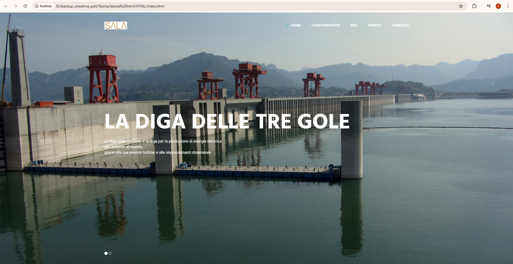

# Three-Gorges-Dam---Educational-Multimedia-Project
An interactive web presentation exploring the Three Gorges Dam, the world's largest hydroelectric power station. This educational project analyzes the engineering marvel's technical specifications, environmental impact, and socio-political implications through a multimedia, interdisciplinary approach combining geography, science, and technology.

A comprehensive web-based presentation about the Three Gorges Dam in China, developed as a high school final examination thesis (Tesina di Maturità).

## 📸 Screenshots




## 📚 Educational Context

This project was created as an interdisciplinary thesis for the Italian high school final examination (Esame di Stato), exploring one of the world's most impressive engineering achievements and its multifaceted impact.

### Subjects Covered
- **Geography**: Location, environmental impact, territorial changes
- **Science**: Hydraulic engineering, renewable energy production
- **English**: International documentation and sources
- **IT and Engineering**: Dam construction, turbine systems, ship lift mechanisms, html and css coding

### Educational Objectives
- Analyze the relationship between technological progress and environmental sustainability
- Understand the socio-economic impact of large-scale infrastructure projects
- Develop critical thinking about energy policies in developing nations
- Present complex technical information in an accessible format

## 🌐 Project Structure

### Main Pages

#### `index.html` - Homepage
- Project introduction with image carousel
- Overview of the Three Gorges Dam
- Featured content: "Still Life" film reference
- Quick navigation to all sections

#### `caratteristiche.html` - Technical Characteristics
- Dam specifications (185m height, 2,309.47m length)
- Reservoir data (22 billion m³ capacity)
- Ship lift description (15,000 tons structure)
- Francis turbines (32 units, 700 MW each, total 22.5 GW)
- Spillway systems and water regulation

#### `pro.html` - Advantages
- Energy production (110 TWh annually, ~3% of China's needs)
- CO₂ emission reduction
- Renewable energy contribution (~15% of China's target)
- Oil savings (140 billion barrels/year)
- Flood control benefits

#### `contro.html` - Disadvantages
- Population displacement (1.4 million people relocated)
- Archaeological sites submerged (1,300+ sites)
- Biodiversity loss (Baiji dolphin extinction)
- Environmental degradation
- Satellite imagery comparison (before/after)

#### `curiosita.html` - Curiosities
- **Film**: "Still Life" by Jia Zhang-ke (Venice Film Festival winner)
- **Air Pollution**: China's environmental challenges
- **Foreign Policy**: Water management and geopolitical implications
- **Conclusion**: Video on marine pollution and environmental awareness

#### `ing.html` - Engineering Deep Dive
- Comparative analysis of hydraulic lifts (Niederfinow, Falkirk Wheel)
- Turbine types: Francis, Pelton, Kaplan
- Spillway systems and overflow management
- Historical engineering references

## 💻 Technologies Used

### Frontend Framework
- **Bootstrap 3.3.4**: Responsive grid system and components
- **HTML5**: Semantic markup
- **CSS3**: Custom styling with animations

### Libraries & Plugins
- **jQuery**: DOM manipulation and event handling
- **Swiper.js**: Touch-enabled slider/carousel
- **Masonry.js**: Grid layout for image galleries
- **WOW.js**: Scroll-triggered animations
- **Parallax.js**: Parallax scrolling effects

### Design Elements
- **Google Fonts**: Hind (300, 400, 500, 600, 700 weights)
- **Simple Line Icons**: Minimalist iconography
- **Custom animations**: CSS3 transitions and transforms

### Template
- Based on **Metronic "Asentus"** frontend template
- Customized for educational content presentation

## 🚀 Installation & Viewing

### Local Setup
1. Clone or download the project repository
2. Extract all files maintaining the folder structure
3. Open `index.html` in a modern web browser

### Required Folder Structure
```
project-root/
├── index.html
├── caratteristiche.html
├── pro.html
├── contro.html
├── curiosita.html
├── ing.html
├── css/
│   ├── layout.min.css
│   └── animate.css
├── js/
│   ├── layout.min.js
│   └── components/
├── vendor/
│   ├── bootstrap/
│   ├── jquery.min.js
│   ├── swiper/
│   └── masonry/
├── img/
│   ├── logo1.jpg
│   ├── 970x647/
│   ├── 770x860/
│   ├── 640x380/
│   ├── 800x400/
│   └── 397x300/
└── video/
    └── 1.mp4
```

### Browser Compatibility
- Chrome/Edge (recommended)
- Firefox
- Safari
- Opera

**Note**: Internet connection required for Google Fonts loading.

## 📖 Navigation Guide

The website features a fixed navigation bar with five main sections:
1. **Home**: Project overview and introduction
2. **Caratteristiche**: Technical specifications
3. **Pro**: Environmental and economic advantages
4. **Contro**: Social and ecological impacts
5. **Curiosità**: Cultural references and additional insights

Each page includes a "Back to Top" button for easy navigation.

## 🎓 Presentation Notes for Oral Examination

### Key Discussion Points
1. **Interdisciplinary Approach**: How the project connects geography, science, and technology
2. **Critical Analysis**: Balanced presentation of advantages and disadvantages
3. **Technical Skills**: Web development abilities demonstrated
4. **Research Methodology**: Sources consulted and information verification
5. **Environmental Ethics**: Personal reflection on sustainable development

### Technical Demonstration
- Responsive design adaptation (mobile/tablet/desktop)
- Interactive elements (carousel, parallax effects)
- Content organization and user experience
- Multimedia integration (images, video)

## 📚 Sources & Bibliography

### Primary Sources
- UN Framework Convention on Climate Change documentation
- Chinese government official reports on Three Gorges Project
- Pew Charitable Trusts: "Who's Winning the Clean Energy Race"

### Academic References
- Environmental impact studies on the Yangtze River
- Engineering journals on hydroelectric power systems
- Sociological studies on population displacement

### Media & Film
- "Still Life" (2006) - Dir. Jia Zhang-ke
- Documentary footage on dam construction
- Satellite imagery from environmental monitoring organizations

### Online Resources
- Keenthemes.com (Metronic template documentation)
- Bootstrap official documentation
- Technical specifications from dam management authorities

### Journalistic Sources
- Emilia Maria Pezzini (2012) - Articles on Chinese energy sustainability
- International news coverage on Three Gorges Project
- Environmental journalism on air and water pollution in China

## 👨‍🎓 Project Information

**Author**: Sala Daniele  
**Academic Year**: 2017-2018   
**School Level**: High School Final Year (Esame di Maturità)  
**Project Type**: Interdisciplinary Thesis (Tesina)  
**Development Period**: Final academic year

## 📄 License & Academic Integrity

This project was developed for educational purposes as part of a high school examination. The content represents original research and analysis by the student, with proper attribution to sources consulted.

**Template Credits**: Metronic "Asentus" by KeenThemes  
**Educational Use**: Free for academic presentation and portfolio purposes

## 🔧 Future Improvements (Post-Graduation)

Potential enhancements for portfolio version:
- Migration to Bootstrap 5 or modern framework
- Mobile-first responsive optimization
- Accessibility improvements (ARIA labels, screen reader support)
- Multilingual support (English, Chinese translations)
- Updated statistics and recent developments
- Interactive data visualizations
- Performance optimization

---

**Note**: This project represents a snapshot of research conducted during high school. Some data may require updates for current accuracy. The educational value lies in the interdisciplinary approach and technical implementation rather than real-time information.
